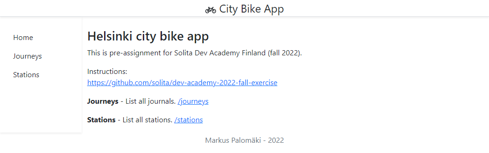

# Helsinki city bike app (Dev Academy pre-assignment)
<br>

>**:information_source: This README is updated after the deadline (August 14th). [Here is the project version, which was released in time](https://github.com/markspl/dev-academy-pre-assignment/tree/ad412cff49ca570fcc6650a27100e702443b7068). README was updated after the deadline to include missing instructions and clarify/correct text (with additional screenshots).**

#### This is a pre-assignment for Solita Dev Academy Finland (fall 2022).

Instructions:<br>https://github.com/solita/dev-academy-2022-fall-exercise

The assigment required to develope a web application that uses a backend service to fetch the data. Backend could use a database or memory-based solutions to store journey and bicycle stations data. Finally, frontend shows data for users.

<br>

*Overall, it was really fun and interesting to work on the project. I'm really happy about what I've done, even the app and backend server has some minor things which I would improve (e.g. backend server function structure, "controller" file) to make code easier to read.*

*Because the project is a pre-assignment, I would continue working with this in another branch!*

*While working on this project I wanted to challenge myself so I selected a new language for me (Golang) which was listed on instructions. In addition to learning new language, and how to use its packages, I also learned how to export enormous data files into a database using queries, how to handle/validate the data. I also got more familiar with React and other technologies.*

- - -

1. [How-to](#How-to)
	* 1.1. [Backend](#Backend)
	* 1.2. [Frontend](#Frontend)
2. [Technologies](#Technologies)
	* 2.1. [Data validating and checking](#Datavalidatingandchecking)
	* 2.2. [Database](#Database)
	* 2.3. [To-Dos](#To-Dos)
	* 2.4. [Learnings (a few of may "a-HA" moments)](#Learningsafewofmaya-HAmoments)
	* 2.5. [Screenshots](#Screenshots)

- - -

##  1. <a name='How-to'></a>How-to

###  1.1. <a name='Backend'></a>Backend
- Download files belown
    - Journey CSV files into `./backend/database/dataset/journeys/`
    - Stations CSV file into `./backend/database/dataset/stations/`
- Go to `./backend/`
- Run backend `go run .`
    - which will create SQLite database into `./backend/database/db/`
- REST API server runs on `localhost:3000`

> **Download links**
>
> Journey dataset:
> - https://dev.hsl.fi/citybikes/od-trips-2021/2021-05.csv
> - https://dev.hsl.fi/citybikes/od-trips-2021/2021-06.csv
> - https://dev.hsl.fi/citybikes/od-trips-2021/2021-07.csv
>
> Helsinki Region Transport’s (HSL) city bicycle stations:
> - Dataset: <https://opendata.arcgis.com/datasets/726277c507ef4914b0aec3cbcfcbfafc_0.csv>
> - License and information: <https://www.avoindata.fi/data/en/dataset/hsl-n-kaupunkipyoraasemat/resource/a23eef3a-cc40-4608-8aa2-c730d17e8902>

Addresses:
> GET `localhost:3000/api/journeys`
>
> GET `localhost:3000/api/stations`
>
> GET `localhost:3000/api/stations/:id`

###  1.2. <a name='Frontend'></a>Frontend
- Go to `./frontend`
- Install packages `npm i`
- Run frontend `npm start`
- App runs on `localhost:8080`

**Addresses:**
> Frontpage `localhost:8080/`
>
> List of journeys `localhost:8080/journeys/`
>
> List of stations `localhost:8080/stations/`
>
> List of stations `localhost:8080/stations/:id`

- - -

##  2. <a name='Technologies'></a>Technologies

- Backend
    - GoLang (go-sqlite3, mux)
    - SQLite

- Frontend
    - React (react, react-dom, react-router, react-router-dom)
    - Axios
    - Bootstrap (react-boostrap)

###  2.1. <a name='Datavalidatingandchecking'></a>Data validating and checking
- Validates data using regex
    - ID Regex: 
        >`^\d+$`
        > (E.g. "093")
    - Number Regex:
        > `^\d+(?:\.\d+)?$`
        > ("215" and "124.4")
    - Time Regex:
        > `^[2][0-9]{3}-(0[0-9]|1[0-2])-([012][0-9]|3[0-1])T([01][0-9]|2[0-3]):([0-5][0-9]):([0-5][0-9])$`
        > 
        > ("2021-05-21T18:34:11")

- Checks data
    - If a journey lasted for less than 10 seconds
    - If a journey covered distance is shorter than 10 meters

- Import and insert lasts ~2min

###  2.2. <a name='Database'></a>Database
- Uses [SQLite](https://www.sqlite.org/index.html) with `go-sqlite3` driver by [mattn](https://github.com/mattn/go-sqlite3)
- Creates database table with primary key integer

#### Journeys
```txt
Id                   INTEGER PRIMARY KEY,
Departure            TEXT NOT NULL,
Return               TEXT NOT NULL,
DepartureStationId   TEXT NOT NULL,
DepartureStationName TEXT NOT NULL,
ReturnStationId      TEXT NOT NULL,
ReturnStationName    TEXT NOT NULL,
Distance             TEXT NOT NULL,
Duration             TEXT NOT NULL
```

#### Station
```txt
FID        int64   `json:"fid"`
ID         string  `json:"id"` // "103", "014", "001"
Nimi       string  `json:"nimi"`
Namn       string  `json:"namn"`
Name       string  `json:"name"`
Osoite     string  `json:"osoite"`
Adress     string  `json:"adress"`
Kaupunki   string  `json:"kaupunki"`
Stad       string  `json:"stad"`
Operaattor string  `json:"operaattor"`
Kapasiteet int64   `json:"kapasiteet"`
X          float64 `json:"x"`
Y          float64 `json:"y"`
```

- - -

### 2.3. <a name='To-Dos'></a>To-Dos

#### Data import
##### Recommended
- [x] Import data from the CSV files to a database or in-memory storage
- [x] Validate data before importing
- [x] Don't import journeys that lasted for less than ten seconds
- [x] Don't import journeys that covered distances shorter than 10 meters

After filtering short (time and distance) journeys, `2021-05.csv` input file's data dropped from `814676` to `784794` rows.

#### Journey list view
##### Recommended
- [x] List journeys
    - [x] GET all journeys (limited to 100) `localhost:3000/api/journeys/`
    - [x] Show on frontend (show departure and return stations, distance (km), and duration (min))

#### Station list
##### Recommended
- [x] List all stations
    - [x] GET all stations `localhost:3000/api/journeys/`

#### Single station view
##### Recommended
- [x] Show
    - [x] station name
    - [x] station address
    - [x] total number of journeys starting from the station
    - [x] total number of journeys ending at the station

#### Other

Because the idea of the project is interesting, I would like to work more with the project. Here are a few of things which I would like to implement:

- Dockerize backend
- Authentication in SQLite
- OpenStreetMap on `stations/:id`
- Pagination

Because the project is pre-assignment, coming changes would be done to a different branch.

- - -

###  2.4. <a name='Learningsafewofmaya-HAmoments'></a>Learnings (a few of may "a-HA" moments)
- Go (Golang) as a new language
    - Using Go packages
    - Use multiple `.go` files
    - The file path must be relative to the folder, where `main.go` file is.
- Creating, connecting and using databases

- - -

###  2.5. <a name='Screenshots'></a>Screenshots


<br>


